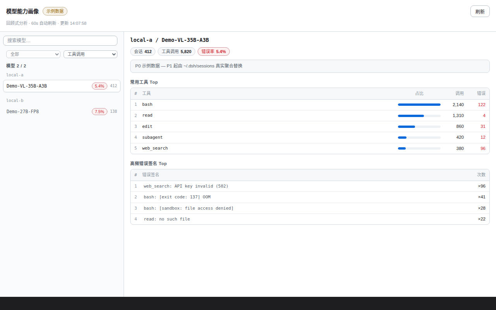

# dsh-cap-profile

**语言 / Language: [中文](README.md) | [English](README.en.md)**

模型能力画像面板——DSH（DeepSeek Harness）插件。



## 功能

回顾式分析本地 DSH 会话历史（`~/.dsh/sessions`，zstd 压缩的 JSONL），按模型生成能力画像：

- **模型对比表**：每个模型（provider / model）的会话数、工具调用数、错误数、错误率。
- **工具 Top5**：该模型最常调用的工具与各自错误数。
- **错误签名 Top5**：归一化后的高频错误模式（如 `bash: [exit code: 137] OOM`），快速看出模型「易翻车」面。
- **时间范围筛选**：全部 / 近 7 / 近 30 / 近 90 天 / 今天 / 昨天（锚点 = 数据中最大日，对系统时钟漂移免疫）。

## 特性

- **只读**：面板只做分析展示，从不修改会话数据；路由校验客户端头 + Origin/Referer，跨源请求 403。
- **增量缓存**：per-file mtime 基线，后台增量扫描（60s 增量 / 24h 全量），首扫未完成时回退上次缓存或 mock，路由不阻塞。
- **零运行时依赖**：纯 Node.js（Node ≥ 20，多 frame zstd 解码用内置 `zstdDecompressSync`）。

## 安装

在 DSH 的 web profile 目录（profile 的 `package.json` 所在目录，默认 `~/.dsh/profiles/web`）执行：

```bash
cd ~/.dsh/profiles/web
pnpm add github:Ansonfishing/dsh-cap-profile
```

然后确认 `package.json` 的 `dsh.profile.bundles` 数组里包含 `"dsh-cap-profile"`，重启 `dsh` 即可。安装后在会话视图 tab 列出现「能力画像」tab（order 40）。

### 本地开发

clone 本仓库后在 profile 里用 link 依赖：

```bash
cd ~/.dsh/profiles/web
pnpm add link:../path/to/dsh-cap-profile
```

客户端改动只需浏览器 F5；Node 侧（`index.js` / `lib/*.js`）改动需重启 `dsh`。数据来自当前用户 `~/.dsh/sessions`；首次打开触发后台首扫（大历史约 20s 级），期间显示 mock 数据。

## 开发

```bash
npm test                     # node --test test/*.test.mjs
```

开发预览见上文「本地开发」（profile link 依赖 + 重启 `dsh`）。

`test/harness/index.html` 是独立的浏览器渲染 harness（mock 数据，`?scenario=mock|live|empty|error&chrome=0`），用于不依赖 dsh 环境验证面板渲染。

## 许可证

[MIT](LICENSE) © Ansonfishing
